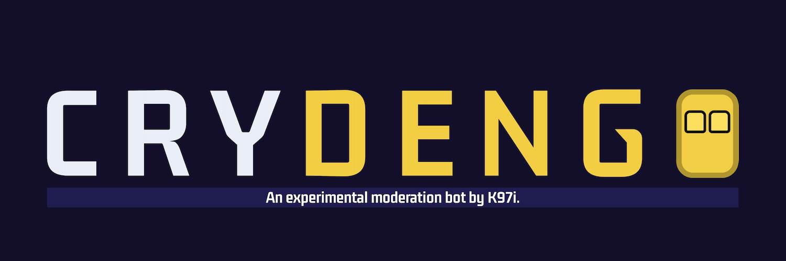

<div style="display: flex; flex-flow: column; justify-content: center">
	<h1 style="text-align: center">Crydengo</h1>
	</img>
</div>

## Description

Crydengo is an experimental moderation bot by K97i, written in Discord.js.

Created for **The Foxtale Discord Server**, its purpose is to catch Discord bots (primarily the prevalent crypto casino image scam bots) that slip past Discord's auto-mod feature by avoiding mass-pings. It intends to work hand-in-hand with the current auto-mod setup, and could potentially replace the current auto-mod setup through its flexibility with Javascript code, allowing better features (like a more extensive regex feature).

## Run Bot

### Locally

1. Insert token in `src/configs/config.json`

```json
{
	"token": "[YOUR-TOKEN-HERE]",
	"clientID": "[YOUR-APPLICATION-ID-HERE]"
}
```

2. Change directory to /src (`cd src`).
3. Run `npm run dev`.

### With Docker

Docker allows a program to run similarly universally by separating it from the main host machine.

1. Insert token in `src/configs/config.json`

```json
{
	"token": "[YOUR-TOKEN-HERE]",
	"clientID": "[YOUR-APPLICATION-ID-HERE]"
}
```
2. Change directory to root folder (this folder).
3. Run `docker compose up --build` (optionally, run with the `-d` flag to run the container in the background). 

## License

Crydengo is licensed under the GNU General Public License v3.0. See full terms in [LICENSE.md](./LICENSE.md).

## Disclaimer

**Crydengo isn't perfect.**  

Automating moderation is hard. False-positives and false-negatives **will** happen at some point. You have to perfectly balance leniency and explicit rules to get the least amount of false-positives and false-negatives.

**Crydengo solves a temporary problem.**

Fighting against an ever-evolving sleuth of bots is an eternal battle until one side quits. I expect this bot will need to be updated in the next few months because of said crypto casino scam not being the new botted activity.

**Crydengo isn't an all-in-one moderation solution.**

Because it was primarily made for The Foxtale Discord server, Crydengo's feature set is incredibly small for what it should be. I focused on what I noticed on the server. There are many things I'd like to implement to the bot before it becomes a proper moderation solution (spam detection, raid detection, etc.).